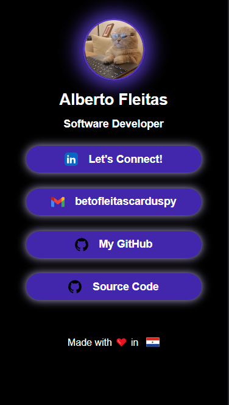

# 🚀 Landing page like LinkTree

Simple landing page like LinkTree that contains my links. 
Made with  HTML and CSS.

[Live Demo](https://betofleitass.github.io/)

## 📷 Screenshots




## 🔥 Skills
HTML, CSS, Git

## 👐 Contributing

Contributions are always welcome!

- Fork this repository;
- Create a branch with your feature: `git checkout -b my-feature`;
- Commit your changes: `git commit -m "feat: my new feature"`;
- Push to your branch: `git push origin my-feature`.

## 💻 Run Locally

Clone the project

```bash
  git clone https://github.com/betofleitass/betofleitass.github.io
```

Go to the project directory

```bash
  cd betofleitass.github.io
```

Open with VSCode

```bash
  code .
```

Customize the code.

## 👦 Authors

- [@betofleitass](https://www.github.com/betofleitass)


## 🙌 Acknowledgements
 - [Takuya Matsuyama's](https://www.craftz.dog/) [video tutorial](https://www.youtube.com/watch?v=u71pHOyvBp0&ab_channel=devaslife)
 - [Markdown Editor](https://readme.so/es/editor)
 - [SVG Icons](https://uxwing.com/)


## 📓 License

This project is under [MIT License.](https://choosealicense.com/licenses/mit/)

